## 260107
### AI 개발 프로세스
- 일반적인 AI 개발 프로세스는 문제 정의에서 데이터 수집 및 전처리, 모델 설계 및 개발, 학습 및 최적화, 평가 및 검증, 배포 및 모니터링으로 이루어짐
- 각 단계는 유기적으로 연결되어 있으며, 단순한 선형적 과정이 아닌 지속적 개선이 핵심인 순환형 라이프 사이클임

- 문제 정의 -> 데이터 수집 -> 모델 개발 -> 학습 -> 성능 평가 -> 배포 -> 모니터링
- AI 시스템을 기획해서 운영 환경에 안착시키고, 이후에도 성능 저하나 데이터 드리프트 등을 감시하며 유지보수가지 포함한 "엔드 투 엔드" 프로세스라고 볼 수 있음

### 머신러닝 파이프라인
- 전처리(Preprocessing) : 원시 데이터를 모델이 학습할 수 있게 변환
- 추론(Inference) : 학습된 모델이 실제 입력에 대해 결과 생성
- 후처리(Postprocessing) : 모델 출력 결과를 사용자나 서비스가 쓸 수 있게 다듬음
- 학습(Learning) : 모델이 데이터를 보고 가중치를 최적화
- 성능 평가(Evaluation) : 학습된 모델 성능 측정

### 전처리(Preprocessing)
: 전처리는 원시(RAW) 데이터를 AI 모델이 처리(학습이나 추론)할 수 있는 형태로 변화하는 과정임

: 데이터의 품질을 향상시키고, 모델의 성능을 최적화하는데 중요한 역할을 함
- 컴퓨터 비전
    - 크기 조정(Resizing)
        
        : 모델이 요구하는 입력 크기(폭/높이)로 통일하기 위해 이미지를 확대 또는 축소함

    - 비율 유지 패딩(Letterbox padding)

        : 이미지의 원래 종횡비(aspect ratio)를 유지하면서 목표 크기로 조정하는 기법임

        : 리사이징과 달리 이미지를 왜곡시키지 않고 대신 여백을 추가함

    - 정규화(Normalization)

        : 픽셀 값을 일정 범위(0-1 범위)로 정규화 하거나 표준 편차로 나누어 표준화함

        : 다른 이미지를 빠르게 비교 가능하게 만들어 알고리즘 성능을 향상시키고 모델의 데이터 수렴 속도를 높여줌

    - 색상 보정(Color Correction)

        : 이미지의 색상을 조정하여 일관된 색상 표현을 제공하거나 특정 조건(조명, 대비 등)에 맞게 보정하는 기법

        : 다양한 환경에서 촬영된 이미지의 일관성을 높여서 모델이 색상 변화에 덜 민감하게 함

    - 데이터 증강(Data Augmentation)

        : 회전, 반전, 자르기(Crop), 색 공간 변환 등을 통해 원본 이미지를 다양하게 변형함으로써 데이터셋을 확장함
        
        : 과적합 문제(Over-fitting) 문제를 줄이고 모델의 범용성을 높임
    
    - 노이즈 제거(Denoising)
        
        : 가우시안(Gaussian) 필터, 중간값(Median) 필터, 블러링(Blurring) 등을 사용하여 다양한 원인으로 발생하는 이미지의 노이즈를 제거하여 품질을 향상시킴

    - 임계값 처리(Thresholding)

        : 특정 임계 값을 기준으로 이미지 픽셀 값을 두가지(이진화)로 단순화하고 이미지의 배경과 객체로 분류함

    - 경계 감지(Edge Detection)

        : 이미지에서 객체의 경계를 나타내는 밝기가 급격히 변하는 지점을 찾아 이미지의 경계를 식별함

    - 이미지 피라미드(260107/Image Pyramid)
    
        : 원본 이미지의 다양한 해상도 버전을 계층적으로 생성하여 크기가 다른 객체들을 효과적으로 처리함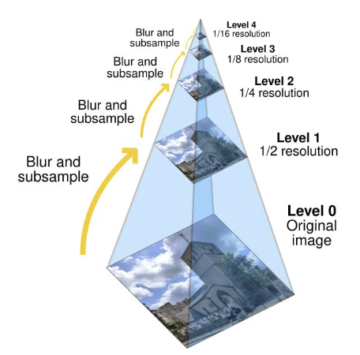

- 자연어 처리_ 텍스트
    - 토큰화(Tokenization)

        : 문장을 단어, 형태소, 서브 워드 또는 문자 수준으로 분할함
        : 예를 들어, "챗봇을 개발합니다" -> ["챗봇", "을", "개발", "합니다"]로 분해함

    - 정제(Cleaning)

        : 텍스트에서 HTML 태그, 이모지, 특수 문자, 불용어("의", "그리고", "the", "is" 등 의미 전달에 큰 영향이 없는 단어) 등 불필요한 텍스트나 공백을 제거하여 일관된 포맷으로 만듦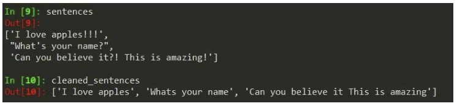

    - 텍스트 정규화(Normalization)

        : 텍스트에서 대소문자 통일, 어간 추출(stemming), 표제어 추출(lemmatization) 등으로 단어의 기본 형태를 찾음
        
        : 예를 들어, '써요', '쓰세요', '썼어요' 등을 '쓰다'로 정규화함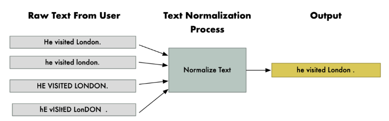

    - 개체명 인식(Named Entity Recognition, NER)

        : 텍스트에서 인물, 장소, 기관, 날짜 등과 같은 고유 명사를 식별하고 분류함
        
        : "손흥민이 바르셀로나에서 5월 1일 경기를 했다"에서 '손흥민'(인물), '바르셀로나'(장소), '5월 1일'(날짜)을 식별하게 함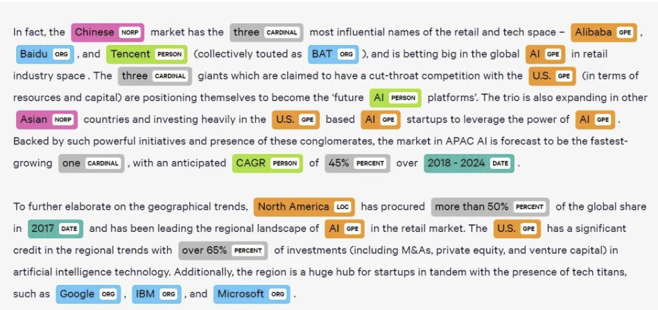

    - 품사 태깅(POS Tagging)

        : 텍스트의 각 단어에 품사 정보를 부여하여 정확도를 높이는 과정
        
        : 예를 들어, '나는'이 명사 + 조사인지, 동사인지 구분할 수 있게 해줌

    - 임베딩(Embedding)

        : RNN이나 Transformer 모델의 입력으로 사용하기 위해 단어나 토큰을 벡터로 변환함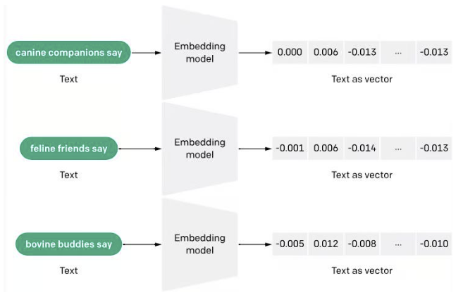

    - 시퀀스 패딩(Padding)

        : 모든 문장이나 문서를 동일한 길이로 만들기 위해 부족한 텍스트에 패딩 토큰을 추가함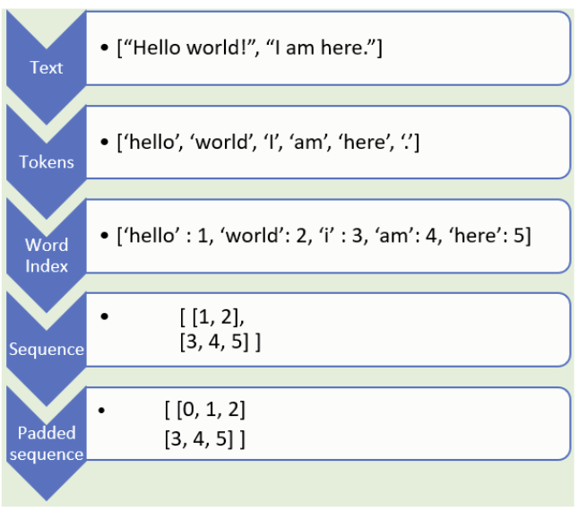

- 자연어 처리_ 음성
    - 프레이밍(Framing)

        : 음성이 이 정도 시간 동안은 준정적(quansi-stationary) 특성을 갖기 때문에 긴 음성 신호를 짧은 구간(프레임)으로 나눔

        : 일반적으로 20-40ms 길이의 프레임을 사용함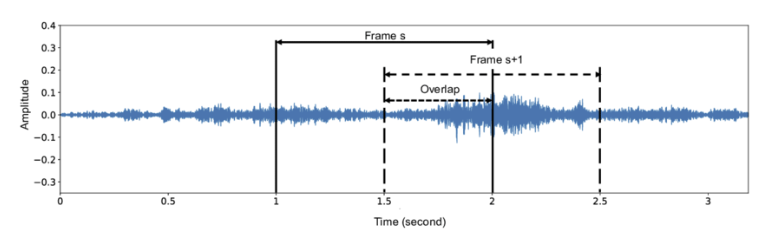

    - 윈도윙(Windowing)

        : 각 프레임의 가장자리에서 발생하는 불연속성을 완화하기 위해 윈도우 함수를 적용함

        : 이는 프레임 가장자리의 신호를 부드럽게 감소시켜 스펙트럼 왜곡을 최소화함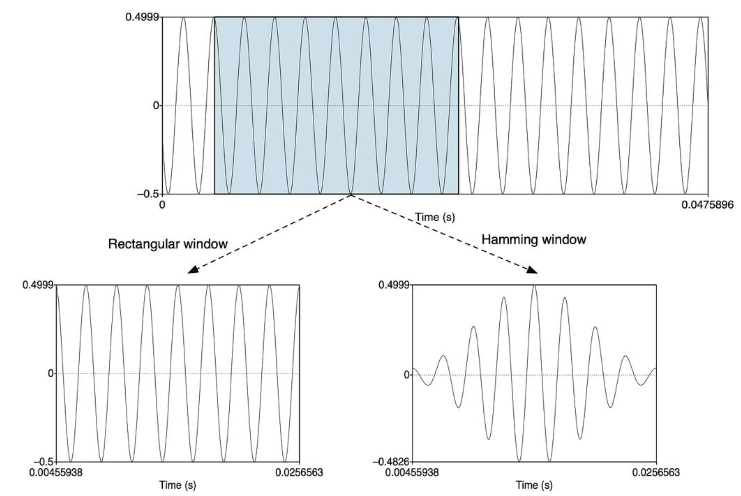

    - 노이즈 제거(Noise Reduction)

        : 배경 소음, 잡음 등을 제거하여 음성 품질을 향상시킴
        
        : 스펙트럼 차감법, 위너 필터링, 딥러닝 기반 노이즈 제거 등 다양한 방법이 사용됨

    - 음성 정규화(Normalization)

        : 음성 신호의 진폭을 일정 범위로 조정함

        : 다양한 녹음 환경과 장비로 인한 볼륨 차이를 보정하여 일관된 입력을 보장함

    - 묵음 제거(Silence Removal)

        : 음성 신호에서 의미있는 발화가 없는 묵음 구간을 식별하고 제거하여 데이터 처리 효율성을 높이고 정확도를 개선함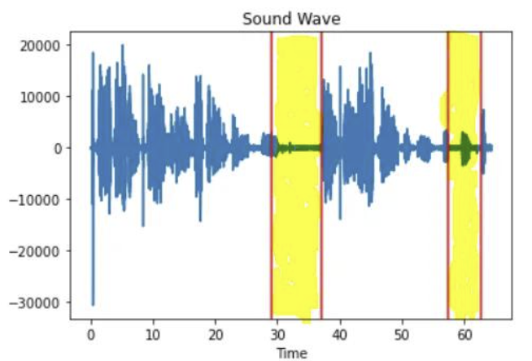

    - 특징 추출(Feature Extraction)

        : 음성 인식 모델의 입력을 위해 음성 신호로붙터 중요한 특징을 추출함

        : MFCC(Mel-Frequency Cepstral Coefficients), Mel-Spectrogram, STFT(Short-Time Fourier Transform) 등이 있음

        : 특히 MFCC는 사람의 청각 시스템을 모방하여 설계되어 음성 인식에 널리 사용됨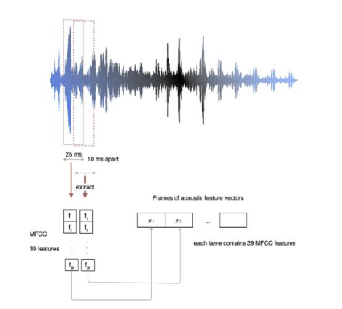

    - 음성 증강(Audio Augmentation)

        : 제한된 음성 데이터셋의 다양성을 증가시키기 위해 시간 단축, 피치 변경, 노이즈 추가 등의 변형을 적용함

        : 모델의 일반화 능력을 향상시키고 과적합(Over-fitting)을 방지함

- 추천/예측
    - 결측치 처리(Missing Value Imputation)

        : 데이터 베이스나 로그에서 수집된 원본에는 누락값(missing value)이 흔함
        
        : 예를 들어, 사용자의 나이를 모르는 경우 0 또는 평균 나이로 채우거나 해당 사용자 데이터를 제외할 수도 있고, 시간대별 수요 예측에서 특정 시간 데이터가 없으면 보관하거나 직전 값으로 대체할 수 있음

    - 사용자-아이템 행렬 구성(User-Item Matrix)

        : 추천 알고리즘을 위해 누가(사용자) 무엇(아이템)에 어떤 평가를 했는지 행렬 형태로 구성함

        : 예를 들어, 행은 사용자, 열은 영화인 행렬에서 각 칸에 평점(1-5점)을 기록함

        : "사용자 A가 '어벤져스'에 5점, '타이타닉'에 3점을 줌"을 행렬로 표현함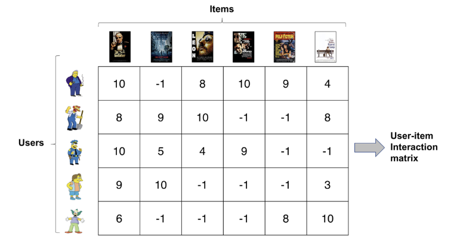

    - 정규화(Normalization)

        : 다양한 스케일의 특성들을 Min-Max, Z-score 정규화를 적용하여 동일한 범위로 조정함
        
        : 예를 들어, 사용자마다 다른 평가 성향을 보정하거나 온도(20-30℃)와 습도(30-90%)를 모두 0-1 사이 값으로 변환함

    - 차원 축소(Dimensionality Reduction)

        : 너무 많은 특성(차원)을 가진 데이터들의 특성(차원)으로 요약하여 계산의 효율성을 높임

        : 추천에서는 SVD(특이값 분해)를 사용해 잠재 특성으로 축소할 수 있고, 예측에서는 PCA(주성분 분석)을 통해 지표들을 축소할 수 있음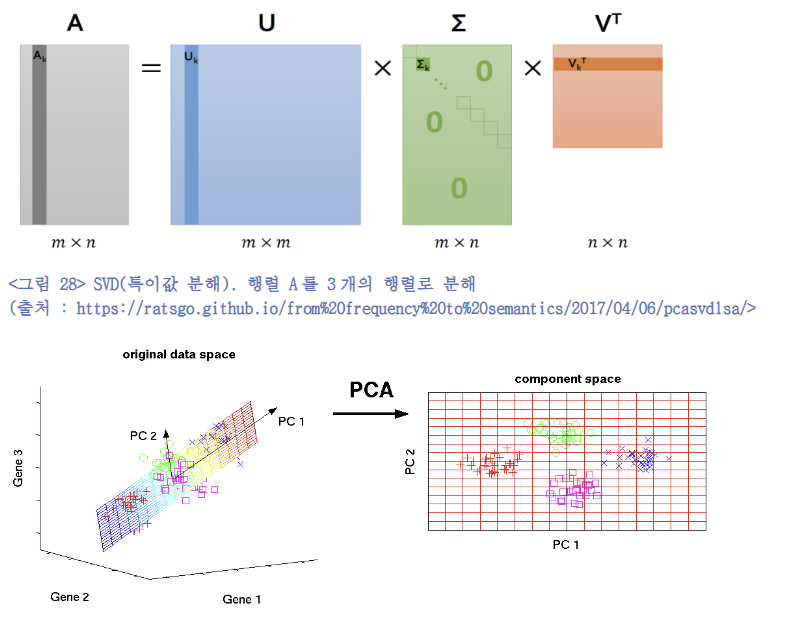

    - 특성 선택(Feature Selection)

        : 이미 존재하는 특성들 중에서 추천이나 예측에 가장 영향력 있는 특성만 선택함

        : 예를 들어, 사용자 정보들 중에서 영화 선호도와 관련성이 높은 특성(나이, 성별)만 선택하거나 날씨 예측 시 온도, 습도, 기압, 풍속 중에서 영향력 있는 변수 3가지만 선별함

    - 범주형 변수 인코딩(Categorical Encoding)

        : 원-핫 인코딩(One-hot encoding) 등을 사용해 범주형 변수를 수치형으로 변환함

        : 예를 들어, 영화 장르의 "액션", "코미디", "드라마"를 [1, 0, 0], [0, 1, 0], [0, 0, 1]로 변환하거나 요일에서 "월", "화"를 [1, 0, 0, 0, 0, 0, 0], [0, 1, 0, 0, 0, 0, 0]로 변환함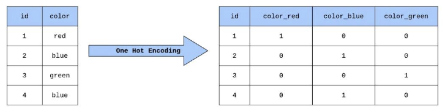

    - 특성 공학(Feature Engineering)

        : 원시 데이터를 기반으로 도메인 지식을 활용해 새로운 파생 특성을 만들어냄

        : 예를 들어, 날짜 -> 요일, 계절, 공휴일 여부 특성을 추가하거나, 웹 로그에서 최근 7일간 활동 횟수를 계산해 넣을 수 있음

        : 추천 시스템에서는 사용자별 통계치(평균 평점, 리뷰 수)나 아이템별 속성(장르, 가격대) 특성을 만들어 성능 향상에 기여할 수 있음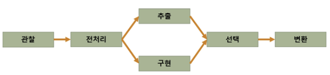

- LLM(대규모 언어 모델)/생성형 AI
    - 텍스트 정규화(Text Normalization)

        : 입력 문장의 특수문자, 이모지, 불필요 공백 등을 제거하고, 언어별 특수 정규화, 숫자/화폐 단위 표준화, 반복 문자 최소화 등을 거침

        : 모든 문장을 모델에 넣을 수 있도록 너무 긴 텍스트는 잘라내거나, 반대로 짧은 문장은 합치는 등의 처리를 함

    - 토큰화 및 인코딩(Tokenization and Encoding)

        : LLM은 서브 워드(Byte-Pair Encoding 등) 기반 토큰화를 사용함

        : 모델이 학습할 때 사용한 것과 동일한 토크나이저(Tokenizer)를 사용하여 텍스트를 토큰으로 분리하고, 해당 토큰을 숫자 ID 시퀀스로 변환하고, 문장 시작/끝 마다 특수 토큰(Beginning Of Sequence 토큰, End Of Sequence 토큰 등)을 삽입해 문장을 구분할 수 있게 함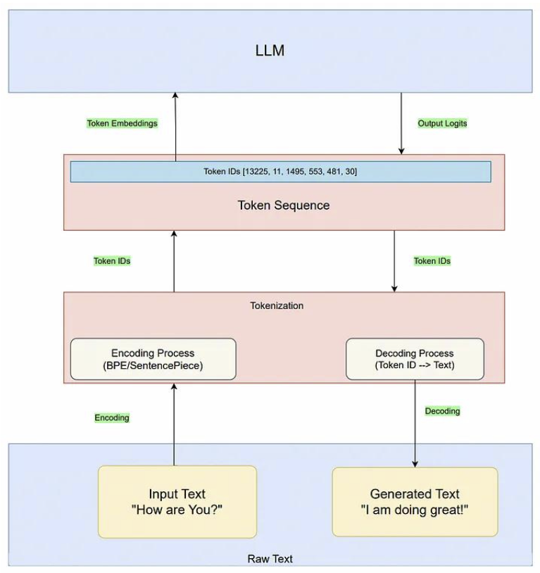

    - 프롬프트 엔지니어링(Prompt Engineering)

        : Few-shot 또는 Zero-shot 템플릿을 구성할 수 잇으며 CoT(Chain-of-Thought), ToT(Tree-of-Thought) 같은 프롬프팅 기법도 존재함

    - 문맥 윈도우 관리(Context Window Management)

        : LLM은 입력 받는 토큰의 제한이 있으므로, 입력 텍스트가 제한을 초과하면 Sliding Window나 Chunking과 같은 기법을 통해 텍스트를 요약하거나 분할하여 처리함

    - 멀티모달 데이터 전처리(Multimodal Data Processing)

        : 이미지, 음성 등 텍스트 외 입력이 있을 경우 이미지 리사이징, 이미지/오디오 정규화, 시퀀스 패딩, 이미지-텍스트 쌍 정렬 등 멀티모달 모델 입력 형식에 맞게 데이터를 변환함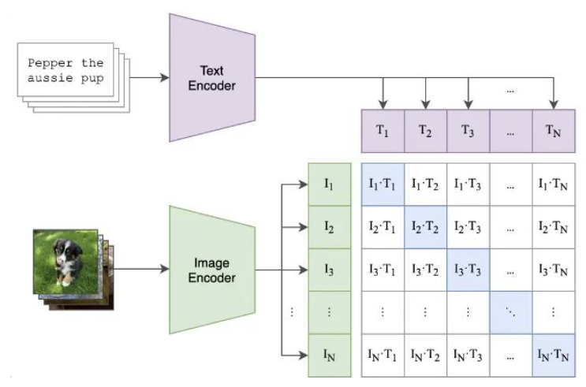

    - 스펙트로그램 변환(Spectrogram Conversion)

        : 음성 생성 모델의 입력을 위해 원시 음성 파형을 시각적으로 변환하여 음성 신호의 주파수 내용이 시간에 따라 어떻게 변하는지 시각화 함

        : 이렇게 변환된 스펙트럼 데이터를 직접 또는 벡터 양자화 및 토큰화하여 모델에 입력함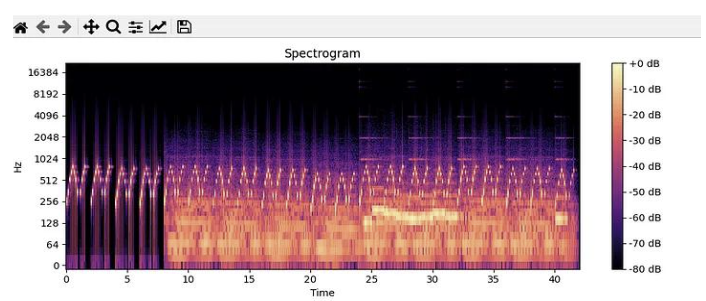

    - 광학 흐름 추정(Optical Flow Estimation)

        : 영상의 연속 프레임 간 각 픽셀들이 어떻게 이동했는지 벡터 필드(움직인 방향, 속도)를 계산하여 모션 정보를 추출함

        : 영상 생성 모델에 명시적인 모션 단서를 제공하기 위해 사용됨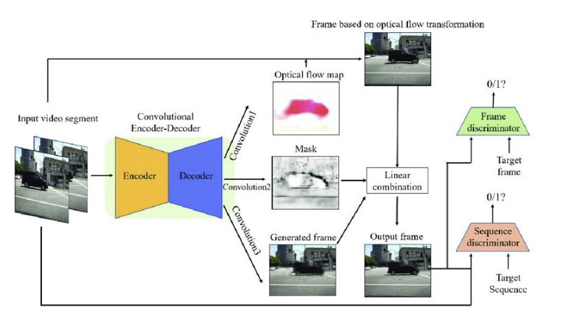

    - 포인트 클라우드 정렬(Point Cloud Alignment)

        : 서로 다른 좌표계나 각도로 얻어진 3D 스캔 데이터(포인트 클라우드)를 같은 기준으로 정렬하는 작업

        : 여러 점들로 이루어진 3D 객체들을 회전 및 이동 변환하여 공통 좌표계에 겹치도록 맞추면 하나의 일관된 모델로 통합할 수 있음

        : 이를 통해 다양한 스캔 데이터로부터 모델을 학습할 때 입력의 일관성을 보장할 수 있음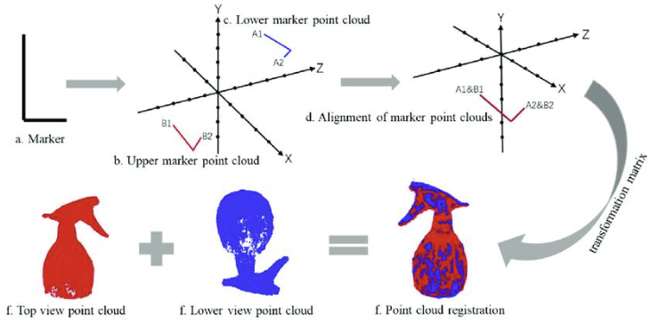