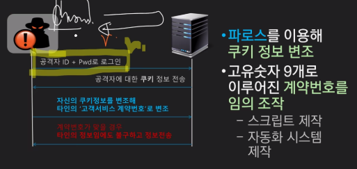
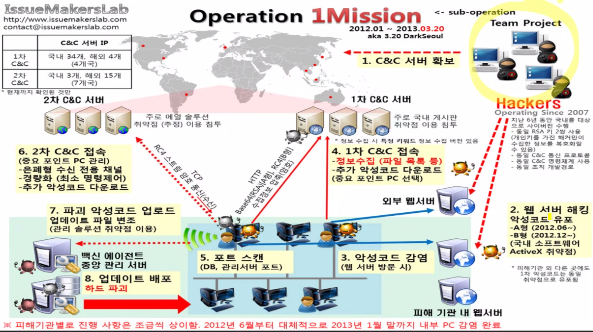

## 개인정보유출 사고 사례

### 2014년 KT 개인정보 유출

: 1200만명 가입자 개인정보가 모두 유출된 사건

: 요금제, 부가서비스, 약정 정보 … + USIM 번호까지 모두 유출(→ 복제폰이 가능해짐)

- 시스템 공격 방법
    - 공격자 : 공격자 ID, PWD로 로그인
    - 서버 : 공격자에 대한 쿠키 정보 전송
    - 공격자 : 자신의 쿠키정보를 변조해 타인의 ‘고객서비스 계약번호’로 변조
        - 파로스를 이용해 쿠키 정보 변조
        - 고유숫자 9개로 이루어진 계약 번호를 임의 조작
            - 스크립트 제작
            - 자동화 시스템 제작
    - 서버 : 계약번호가 맞는 경우 타인의 정보임에도 불구하고 정보 전송
    
    
- 공격자의 활동 요약
    - 3개월간 KT 홈페이지 1266만회 접속(관련 로그기록만 538GB)
    - 특정 IP 주소에서만 1일 최대 34만 여건 접속했으나 이상징후를 감지하지 못함
    - 유출한 정보를 휴대폰 개통 및 판매 영업에 활용하고 타 대리점 3곳에 개인정보(500만건)를 판매
    
    → 경찰이 불법 텔레마케팅 행위 수사 과정에서 우연히 검거됨
    
- 결론
    - 내부의 적까지 고려해 대응해야 함
    - 보안 신뢰 시스템 운영 및 관리 실무자는 협력업체라 하더라도 신뢰하지 않고 검증해야 할 필요성이 있음
    - 정보보안 실무자는 철저한 윤리 의식이 필요
        - 2014년, KCB 협력업체 직원이 3개 카드사 고객정보(약 1억 400만 건)를 약 1,650만원에 판매

### 2013년 3.20 사이버 테러

- 주요 방송사 및 금융사 전산장비 파괴(MBR(Master Boot Record) 손상으로 부팅 불가)로 PC 4만 8천 여대 및 일부 서버, ATM 기기 등도 피해를 입은 초유의 사건
- 2012년 6월부터 악성코드는 배포되고 있었으나 인지하지 못해 큰 피해 발생
- 70종 이상의 악성코드가 발견됐고 분석을 통해 북한의 소행으로 파악

MBR → 자기 디스크 형식인데 10만번 이상 정도를 쓰고 지우고를 반복하면 자성을 잃어 기능을 못함 → File System 자체가 붕괴됨/2차 메모리 자체가 파괴됨

2곳 정도가 이 테러에서 살아남음 → 망분리를 실시하고 있었음 → 내부망을 따로 분리 시켜놓음
- 악성 코드 유입 경로

- 원격코드 실행 취약점
    - 취약한 프로세스가 악성코드에게 권한을 부여해 실행
    - 원격코드(Remote code)는 소프트웨어에 포함되어 있지 않은 코드로 외부 입력으로 주입됨
        - 사용자의 키보드 입력
        - 데이터 파일
    - 소프트웨어의 보안 결함으로 말미암아 주입된 코드가 권한을 부여해 악성 코드를 실행
    - 보통 크리티컬 등급의 높은 위험도로 분류되며 신속한 패치가 중요함
- 결론
    - 각종 관리 시스템은 양날의 검이 될 수 있음
    - PMS(Patch Management System)은 훌륭한 도구이나 잘못 사용될 경우 악성코드 배포 시스템으로 둔갑할 수 있음
    - 조직에서 사용하는 모든 실행 파일에 대해 확실한 통제가 필요함
    - 각종 관리 시스템 자체가 원격코드 실행 취약점을 가질 수도 있다는 사실을 인지하고 대응해야함